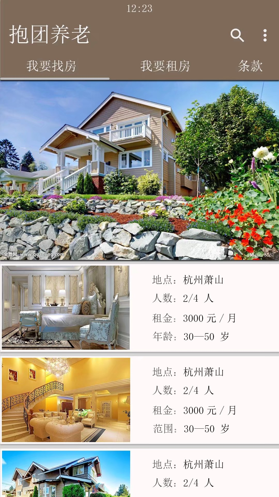
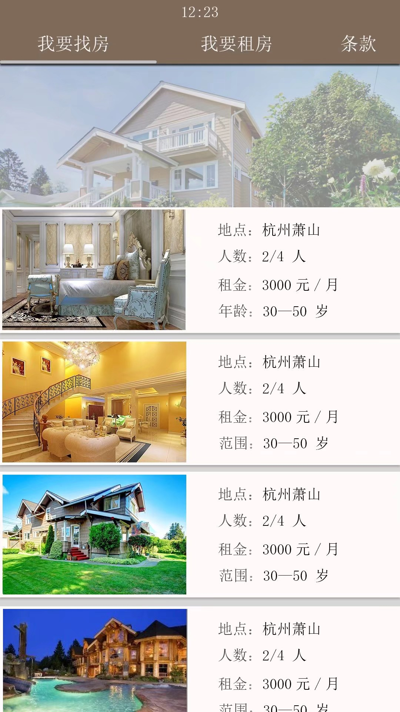
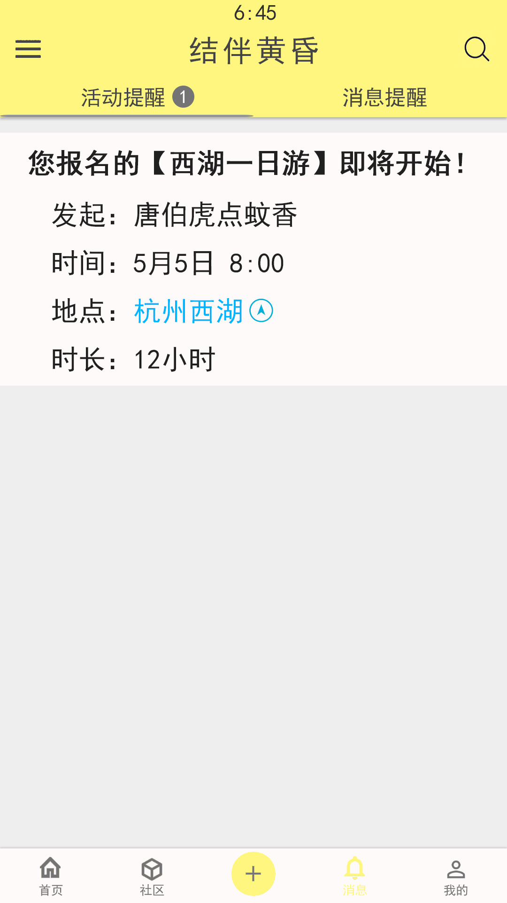
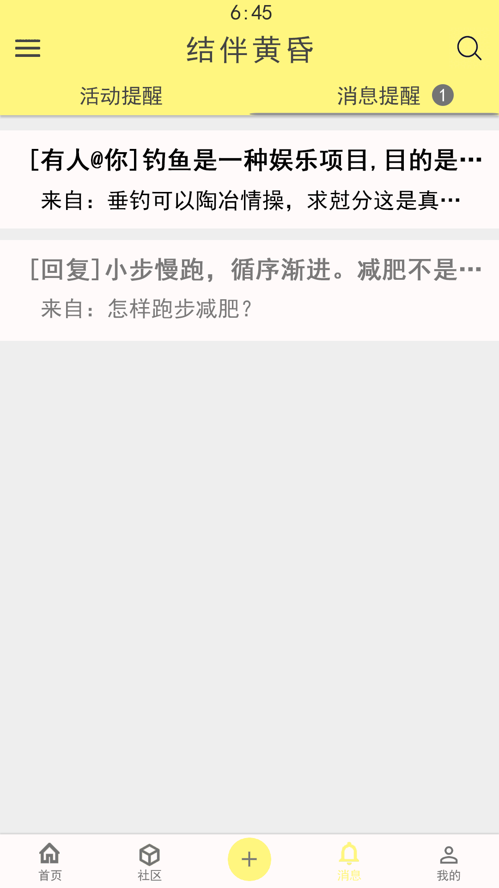
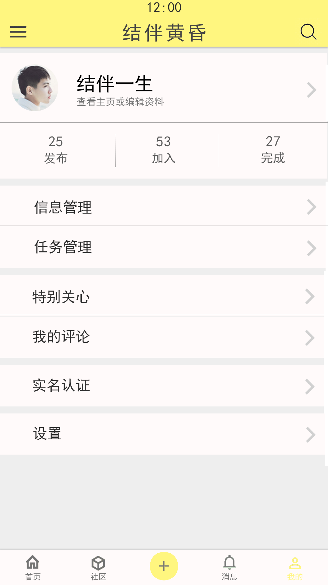
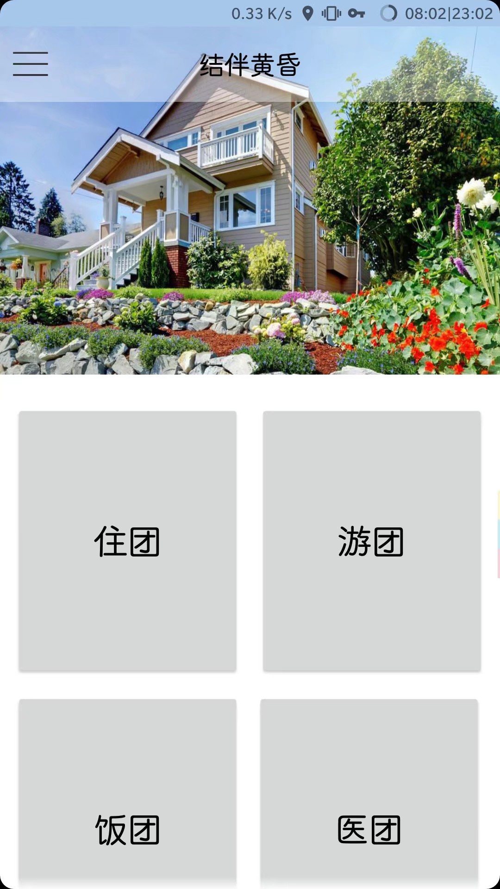
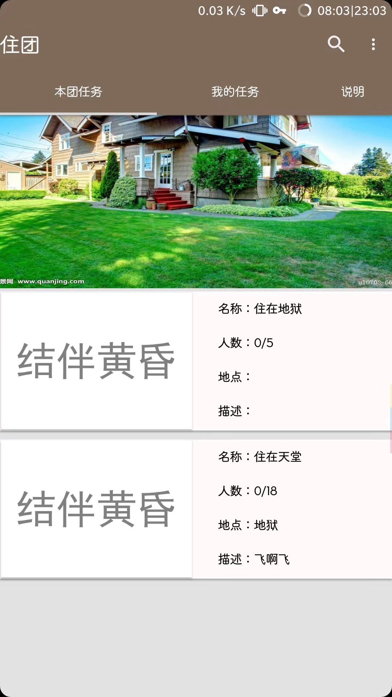
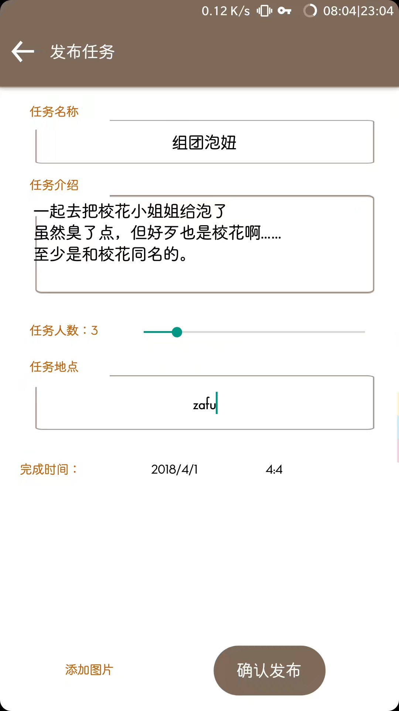
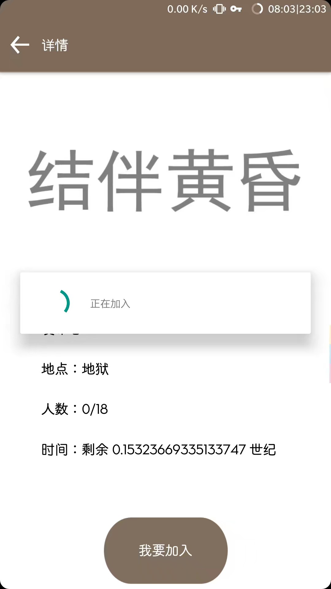

# 结伴黄昏

## 介绍

用来打电商校赛的 APP。

用户登录/注册后，选择类型、时间、地点、人数后，发布任务。

其余用户可选择参加任务。

部分任务在详情界面可以打开 VR 模式。

地图用了高德组件；VR 用的是 Pano2VR5；上传图片用了 okPost 类库。

## 用法

随便选一个类型，进入。显示所有任务。

点右上角的菜单（为了方便），进去注册/登录。

在个人任务那里，可以选择发布任务。

目前不支持发布 VR 图片。

## 说明

目前服务器已挂，显示不出任务。

数据库请自行看代码，我也忘记了……

## 新版截图

都找不到了……

不过比旧版的要好看多了

以下是预览图：

## PS截图

本来是要做新版的，奈何心力憔悴，只能P图了……

## 旧版截图

